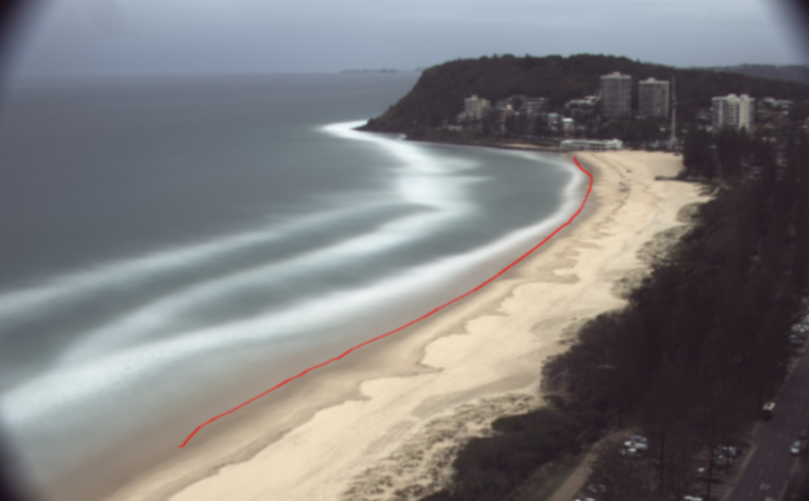
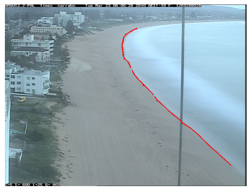

# AI-Driven Shoreline Mapping for Coastal Monitoring
This project uses deep learning and image processing methods to automatically map coastlines, including algorithm engineering and an easy-to-use user interface.

# Note!!!
Before you use the user inferface, please download these model files!!!
CoastSnap.pth: https://github.com/unsw-cse-comp99-3900-24t1/capstone-project-9900f16aleetcodekillers/releases/download/Models/CoastSnap.pth

# Algorithm

## Data Introduction
my_project/  
│  
├── Argus goldcoast/  
│   └── ...  
├── Argus goldcoast shadow/  
│   └── ...  
├── Argus narrabeen/  
│   └── ...  
├── train_set.csv  
├── test_set.csv  
│  
├── Algorithm/  
│   └── ...  
└── ...  
**csv file**: Holds all the data used for training or testing, the *path* column is the path of each image, the *label* column is the set of coastline pixels that have been labeled, and the other columns have other feature categories of the current image that will not affect the training.  
**Image data**: RGB coast images of varying sizes  
**Description**: The project dataset is non-public data, from [Water Research Laboratory (UNSW Sydney)](https://www.unsw.edu.au/research/wrl).  
  
Figure 1 - The pixel point set of label drawn on the original coast image

## Data preprocessing
Combine csv data from different scenarios and outputs them into a trainable csv file
```bash
python Algorithm/DataProcessing/process_dataframes.py --csv_files coastsnap_segment_clean.csv argus_goldcoast_segment.csv segment_narraV2.csv plan.csv --folders 'CoastSnap' 'Argus goldcoast' 'Argus narrabeen' --output_csv data_set.csv
```
Class balance: Use --column to specify the balanced feature, where all classes will have the same amount of data.
```bash
python Algorithm/DataProcessing/balance_dataset.py --input_csv data_set.csv --output_csv balanced_data_set.csv --column site
```
Weighting chanllenging data: Use --column to specify the feature to be weighted, --value to specify the class of the feature to be weighted, and --multiplier to specify the rate of the weighting
```bash
python Algorithm/DataProcessing/weight_hard_examples.py --input_csv data_set.csv --output_csv weighted_data_set.csv --column shadow --value 1 --multiplier 4
```
Split training and test set
```bash
python Algorithm/DataProcessing/split_dataset.py --input_csv data_set.csv --train_csv train_set.csv --test_csv test_set.csv --num_train 1000 --num_test 200
```
Print the number of all categories for all features in the csv file
```bash
python Algorithm/DataProcessing/print_category_counts.py --file_path data_set.csv
```

## Model  
This project uses 3 kinds of convolutional neural network models to realize the training and testing of coastline data. The model code from the following open source projects is used, and we would like to thank:  
DEXINED: https://github.com/xavysp/DexiNed  
UAED & MUGE: https://github.com/ZhouCX117/UAED_MuGE  

## UAED
Before using UAED for training and prediction, you need to install efficientnet-pytorch
```bash
pip install efficientnet-pytorch
```
Train
```bash
python Algorithm/UAED_MuGE/train_uaed.py --batch_size 8 --csv_path 'train_set.csv' --tmp save_path/trainval_ --warmup 5 --maxepoch 25
```
Predict: Use --value to specify the folder name to save the predictions to, and --threshold to specify the threshold for post-processing to use for binarization
```bash
python Algorithm/Test/uaed_predict.py --input_image_path 'Argus goldcoast/.../image0.jpg' --model_path 'Narrabeen.pth' --save_dir result_dir --threshold 200
```
  
Figure 2 - The predicted pixel point set drawn on the original coast image    

Test: Use --binary_threshold to specify the threshold for post-processing to use for binarization, and --distance_threshold to specify the threshold for the ODS method to consider a two-point match  
```bash
python Algorithm/Test/uaed_test.py --input_csv 'test_set.csv' --model_path 'Narrabeen.pth' --save_path 'test_result.txt' --metric_method ODS --binary_threshold 200 --distance_threshold 50
```

## MUGE
Before using UAED for training and testing, you need to install openai-clip and efficientnet-pytorch
```bash
pip install openai-clip
pip install efficientnet_pytorch
```
Train
```bash
python Algorithm/UAED_MuGE/train_muge.py
```
Test
```bash
python Algorithm/Test/muge_test.py --input_csv 'test_set.csv' --model_path 'Narrabeen.pth' --save_path 'test_result.txt' --metric_method ODS --binary_threshold 200 --distance_threshold 50
```

## DEXINED
Before using DEXINED for training and testing, you need to install kornia
```bash
pip install kornia
```
Train
```bash
python DexiNed/main.py
```
Test
```bash
python Algorithm/Test/Dexined_test.py --input_csv 'test_set.csv' --model_path 'Narrabeen.pth' --save_path 'test_result.txt' --metric_method ODS --binary_threshold 200 --distance_threshold 50
```

## Document
We optimized the UAED model for this project. For more details, please read *Algorithm Report.pdf*  
Algorithm/  
└── Algorithm Report.pdf  
